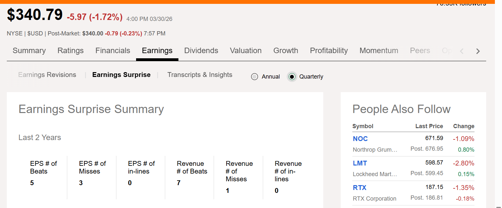
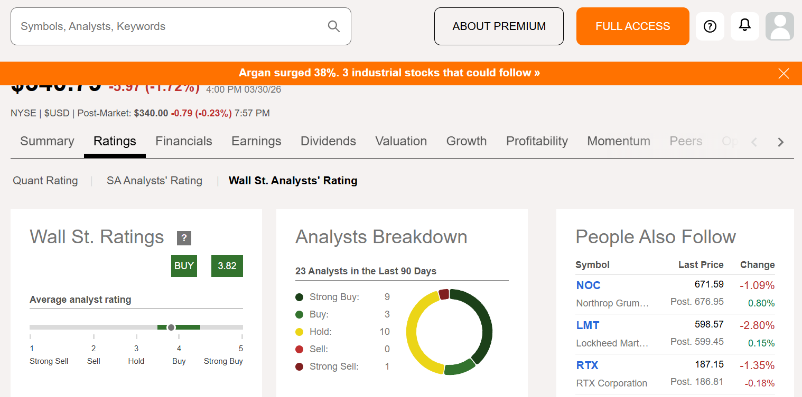

# 米国株の探し方
## 米国株の探し方
・新高値を付けた企業
・決算後のPTSの値上がり益を見る
★米国株が10億ドルの株は危ないので買わない

サイト  
[Seeking Alpha](https://seekingalpha.com/)

## コンセンサス予想チェック
★下記項目はコンセンサス予想を上回っているか？
・今期のEPS
・今期の売上高

・Rating情報
買い売りの評価を確認できる。

## 各指標チェック項目
・売上：右肩あがりか？（10％増だとよき）  
・利益：当期純利益/営業利益が増えているか？  
・PER：50倍を超えない（50倍を超えていたら注意）  
・コンセンサスの予想：超えているか？  
・EPS：上がり続けているか？  
・ROE：10％以上であるか？  
・日足チャート：右肩上がりか？  

## 決算短信チェック項目
・利益が伸びる見通しがあるか？  
・市場は伸びていきそうか？  
・新商品・サービスの状況（口コミやYoutubeで商品をチェック）  
・次の決算でもちゃんと売上が上がっているのか？  

